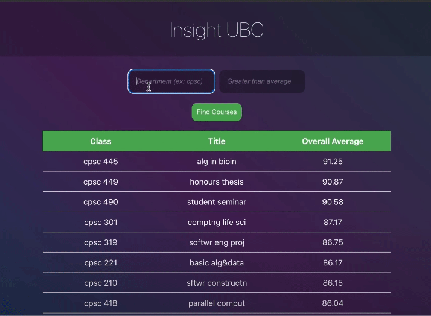

# UBC-Elective-Finder

By Advika Kumari amd Oliver Cheng

Every year, my friends and I are always on the hunt for high-average courses to take that can count for elective credits. We made this application to help my fellow students find the best electives to take given a department/subject they want to study and a certain course average threshold!

Technologies we used:
* used Typescript to effectively convert a zip file with UBC course data to a more manageable local data structure as well as save it on disk to mitigate crashes.
* then implemented an API to query this data structure for the averages of a specific course given by the user.
* used React to implement a seamless and easy to use UI for potential users to quickly pick from the list of availbe courses and choose an average threshold.
* implemented a Rest Endpoints with Express.js to connect the UI to the back-end.

Unfortunately due to UBC restrictions, we are unable to share the full implementation that queries the UBC course data, but we have provided copies of the Front-End implementation and REST API calls if you are curious. Next steps are to make the interface more inuitive to prevent invalid average ranges, provide more information such as profs and grading schemes, and deploy it so anyone can use it.

Here is a demo: 

Enjoy!

